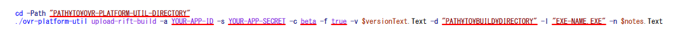
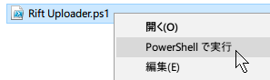

# Oculus Store Content Uploader

Uploader GUI for [ovr-platform-util](https://dashboard.oculus.com/tools/cli/).

## Preparation

1. Download [ovr-platform-util](https://dashboard.oculus.com/tools/cli/)

2. Edit script for your app.  
See **red lines** below (line 66-67 for Rift). (Mobile is subset.)

## Usage

Choose **Run with PowerShell** from context menu.

## License

[Public Domain](https://github.com/yutokun/Oculus-Store-Content-Uploader/blob/master/LICENSE)